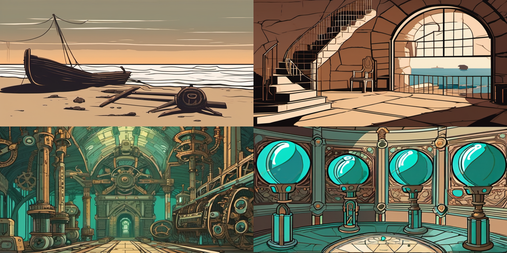

# L'Isola del Naufragio — The Castaway's Isle

> A two-act point-and-click adventure game in the style of Submachine, Syberia, and Journey to the Center of the Earth — built with vanilla JavaScript, procedural audio, and AI-generated art.

> Un'avventura grafica punta-e-clicca in due atti nello stile di Submachine, Syberia e Viaggio al Centro della Terra — costruita con JavaScript vanilla, audio procedurale e arte generata con AI.



---

## 🎮 Play now / Gioca subito

**Play online**: [GitHub Pages release](https://ludwigkubler.github.io/sec-adventure/) *(after deploy)*

**Play locally**:
```bash
git clone https://github.com/ludwigkubler/sec-adventure.git
cd submachine
python3 -m http.server 8000
# open http://localhost:8000
```

Requires: Python 3 (or any static server). No build, no dependencies, no internet. 30MB total.

---

## 🇬🇧 Features (English)

- **Two acts, three endings**: survive the shipwreck, relight the ancient lighthouse, and choose your fate
- **37 hand-crafted rooms** with atmospheric backgrounds generated by Stable Diffusion XL
- **64 items** with hand-drawn SVG icons, 13 of which are lore collectibles with a full codex
- **7 characters** with multi-stage branching dialogues
- **9 multi-step recipes** for crafting essential tools
- **3 interactive mini-puzzles**: 4-wheel combination lock, star alignment, pendulum rhythm
- **2 text riddles** from the ancient Guardian
- **100% procedural audio**: 32 ambient biomes, 16 material-specific SFX, no external files
- **Speedrun mode**: time tracker, completion %, 3 time-based achievements
- **Smart hints**: contextual suggestions never spoil the solution
- **Bilingual IT / EN** with one-click language toggle
- **Accessibility**: respects `prefers-reduced-motion`
- **Secret epilogue**: collect all 13 lore fragments to unlock a narrative twist

### Controls

| Key | Action |
|---|---|
| **Mouse** | Click scene hotspots and inventory |
| **Right click** | Deselect current item |
| **T** | Map |
| **C** | Codex (lore collectibles) |
| **J** | Journal (quest log) |
| **H** | Contextual hint |
| **L** | Toggle IT/EN |
| **M** | Mute audio |
| **?** | Help |
| **ESC** | Close modal / Deselect |
| **Shift+click item** | Examine inventory item |

---

## 🇮🇹 Caratteristiche (Italiano)

- **Due atti, tre finali**: sopravvivi al naufragio, riaccendi il faro antico e scegli il tuo destino
- **37 stanze disegnate con cura** con sfondi atmosferici generati da Stable Diffusion XL
- **64 oggetti** con icone SVG, 13 dei quali collezionabili con codex narrativo
- **7 personaggi** con dialoghi multi-stadio ramificati
- **9 ricette multi-step** per creare strumenti essenziali
- **3 mini-puzzle interattivi**: lucchetto a 4 rotelle, allineamento stelle, ritmo pendolo
- **2 enigmi testuali** del Guardiano antico
- **Audio 100% procedurale**: 32 biomi ambient, 16 SFX per materiale, zero file esterni
- **Modalità speedrun**: timer, % completamento, 3 achievement a tempo
- **Suggerimenti intelligenti** che non spoilerano la soluzione
- **Bilingue IT / EN** con switch lingua al volo
- **Accessibilità**: rispetta `prefers-reduced-motion`
- **Epilogo segreto**: raccogli tutti i 13 frammenti di lore per sbloccare un twist narrativo

---

## 🏗 Architecture

```
submachine/
├── index.html                # Shell
├── css/style.css             # Animations, effects, responsive
├── js/
│   ├── engine.js             # State, rules, flags, recipes, save/load
│   ├── audio.js              # Procedural Web Audio API (32 biomes + 16 SFX)
│   ├── render.js             # DOM rendering, animations (combine, use, particles)
│   ├── ui.js                 # Modals (dialogs, puzzles, codex, map, toasts)
│   ├── input.js              # Mouse + keyboard handling
│   ├── i18n.js               # IT/EN localization
│   └── main.js               # Bootstrap, event wiring
├── data/
│   ├── world.json            # Full world (IT)
│   ├── world.en.json         # Full world (EN)
│   └── expansion.json        # Act II only (source for merge)
├── assets/
│   ├── rooms/*.png           # 36 SDXL backgrounds
│   ├── npcs/*.png            # 7 SDXL portraits
│   └── items/*.svg           # 59 flat-design SVG icons
├── tools/                    # Python: export, audit, SD gen, SVG gen, EN translation
├── docs/                     # Screenshots, trailer, press kit
└── LICENSE
```

### Zero dependencies

No npm, no bundler, no framework. Pure HTML + CSS + vanilla JavaScript. Runs on any static server or `file://` with minor CORS caveats. **Total dependencies: 0**.

---

## 🛠 Development

### Regenerate assets

```bash
# Rebuild world data from source (Italian)
python3 tools/build_expansion.py && python3 tools/export_world.py

# Generate English translation
python3 tools/build_en.py

# Regenerate item icons (SVG)
python3 tools/generate_svg_items.py

# Regenerate room backgrounds with SD-WebUI
python3 tools/generate_sd.py all   # requires SD-WebUI API running

# Audit world integrity (phantoms, unreachable rooms)
python3 tools/audit.py
```

### Testing

```bash
# Syntax check
for f in js/*.js; do node --check $f; done

# Full end-to-end simulation (programmatic)
node tools/simulate.js   # if present
```

---

## 🎨 Art direction

**Act I — Island**: warm sepia and ochre palette, tropical and mysterious, Submachine-inspired atmosphere.

**Act II — Depths**: cold verdigris and bronze palette, clockwork steampunk, Syberia + Verne inspiration.

All backgrounds generated with SDXL using consistent style prompts. 3 fallback backgrounds generated programmatically with PIL for atmospheric coherence when SD was unavailable.

Icons hand-coded in SVG with a palette-locked flat design (7 materials × consistent colors).

---

## 🎵 Audio design

Every sound is synthesized at runtime with the Web Audio API — no mp3/wav files.

- **Ambient music**: 32 biomes, each with a unique combination of oscillators (sine/triangle/sawtooth/square) + LFO detuning + filtered noise. Crossfades smoothly between rooms.
- **SFX**: 16 sounds categorized by action and material:
  - Pickup/combine/use × wood/cord/glass/stone/metal/organic/mystic
  - Plus: door, fail, click, discovery, fanfare, wall_break, sparkle, fusion, puzzle_ok/fail, ending

Result: a complete soundscape in **under 15KB of code**, zero asset loading time.

---

## 📖 Story (no spoilers)

You wake on a beach after a storm. The island is deserted — but not. There's a village. There are riddles. There's an ancient lighthouse that hasn't burned in millennia.

Light it, and maybe a ship will come.

But the lighthouse was never just a lighthouse.

---

## 🏆 Achievements

- **Ancient Light** — Relight the lighthouse
- **Threshold Crossed** — Descend into the well for the first time
- **Under the Stone** — Reach the Lost Agora
- **At the Center** — Reach the Root of the World
- **Explorer** — Visit every room in Act I
- **Codex Complete** — Collect all 13 lore fragments
- **Custodian of the Tree** — Wear the Titanic Crown
- **Speedrunner ⚡** — Light the lighthouse in under 30 minutes
- **Legendary Speedrunner ⚡⚡** — Wear the Crown in under 60 minutes
- **Perfect ✦** — Crown + full Codex in under 90 minutes

---

## 🗺 Roadmap

- [x] v1.0 — Initial release
- [x] v1.1 — QA sprint: 10 playtester agents report fixes
- [x] v1.2 — Audio/narrative/translation polish
- [x] v1.3 — UX redesign: dynamic FX, musical audio, side inventory
- [x] v1.4 — Narrative depth + graphic/menu quality pass (Cinzel, parallax, iris transition, codex flip)
- [x] v1.4.1 — Inventory "Zaino" with ornamental frame and 3-column grid
- [x] v1.5 — SDXL prompts enriched (32 steps, foreground/midground/background composition), 12 SVG items redrawn at professional level, 124 examinable hotspots anchored to scene composition
- [ ] v1.6 — Mobile responsive layout
- [ ] v1.7 — Controller support
- [ ] v2.0 — Extended ending branch (community poll)

---

## 🤝 Contributing

Issues and PRs welcome. See [CONTRIBUTING.md](CONTRIBUTING.md) for guidelines.

Translations to other languages especially welcome — the localization system makes it easy.

---

## 📜 License

MIT License — see [LICENSE](LICENSE) for details.

The narrative text, world design, and character concepts are released under Creative Commons BY-SA 4.0. You are free to adapt and build upon this world provided you credit the original.

---

## 🙏 Credits & inspirations

- **Submachine** (Mateusz Skutnik) — the atmosphere template
- **Syberia** (Microïds) — the mechanical reverence
- **Journey to the Center of the Earth** (Jules Verne) — the underground civilization
- **Machinarium** (Amanita Design) — the minimal visual storytelling

Built by [@ludwigkubler](https://github.com/ludwigkubler) with sec a digital entity.

Generated art: Stable Diffusion XL base model.
Procedural audio: Web Audio API (all hand-synthesized).

---

*« The lighthouse keeps burning in the night. It does not call for rescue. It calls for the next one. »*
